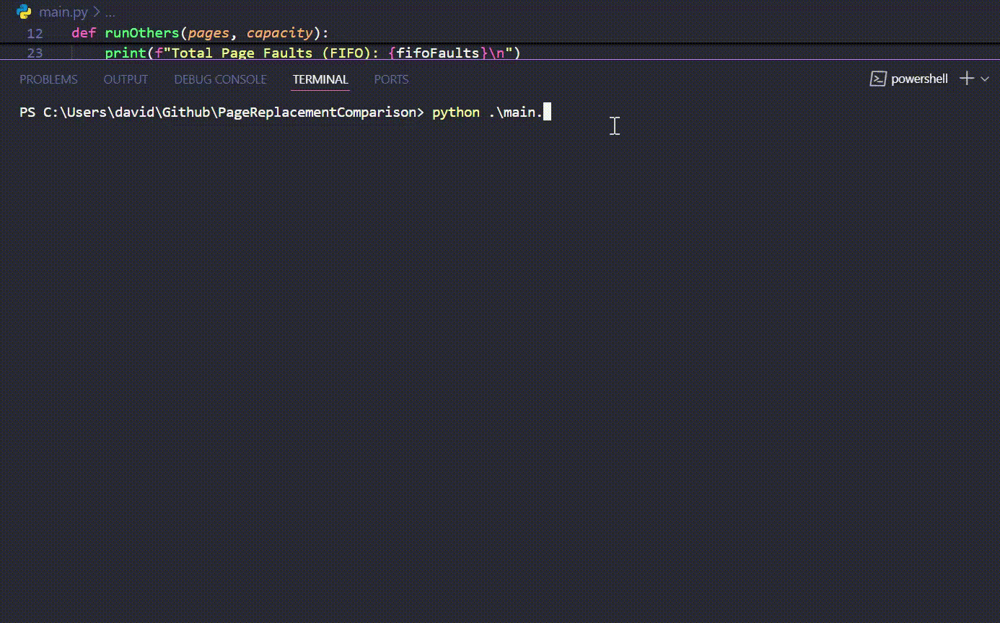

# Comparativo de Algoritmos de Substituição de Páginas 📊

Este repositório contém a implementação e comparação dos algoritmos de substituição de páginas FIFO, LRU e Ótimo. O projeto faz parte da disciplina de Sistemas Operacionais (MATA58) na Universidade Federal da Bahia (UFBA) no semestre 2024.1, ministrada pelo Prof. Robespierre Dantas da Rocha Pita. 🖥️🔄

## 📽️ Apresentação do Projeto
Confira a apresentação do projeto em vídeo abaixo:
[](https://drive.google.com/file/d/1WmQKQ1Kbe-uf2ERU9FgcMYwJ8YAd4C0Y/view?usp=sharing)

Este vídeo fornece uma visão geral detalhada dos objetivos do projeto. É uma ótima maneira de entender o que estamos tentando alcançar e como você pode se envolver. Se você tiver algum problema para assistir ao vídeo ou precisar de mais informações, não hesite em entrar em contato!

### Algoritmo Ótimo 🎯

O algoritmo Ótimo é um método teórico que substitui a página que será usada mais tarde no futuro. Apesar de ser impraticável na vida real devido à necessidade de prever o futuro, ele é fundamental para entender o limite superior do desempenho dos algoritmos de substituição de páginas. Ao comparar o Ótimo com FIFO e LRU, podemos avaliar o quão longe os algoritmos práticos estão em relação ao desempenho ideal.


*Este GIF mostra o funcionamento do algoritmo Ótimo. O algoritmo Ótimo substitui a página que será usada mais tarde no futuro, servindo como uma referência ideal para o desempenho dos algoritmos.*


*Este GIF compara o desempenho do algoritmo Ótimo com os algoritmos FIFO e LRU com as mesmas páginas. Ele ilustra como cada algoritmo lida com a substituição de páginas ao longo do tempo, note que o número de page faults é sempre menor no algoritmo ótimo.*

### Comparação de Algoritmos 🔄

- **FIFO (First In, First Out)**: Substitui a página que está na memória há mais tempo, independentemente de sua utilização recente.
- **LRU (Least Recently Used)**: Substitui a página que não foi usada há mais tempo, com base no histórico recente de acessos.
- **Ótimo**: Substitui a página que será usada mais tarde no futuro, servindo como uma referência para o desempenho ideal.

## 📂 Estrutura do Projeto

- **`algorithms/`**: Pasta contendo as implementações dos algoritmos de substituição de páginas.
  - **`base.py`**: Classe base para todos os algoritmos de substituição de páginas, definindo a estrutura e métodos comuns. 🏗️
  - **`fifo.py`**: Implementação do algoritmo FIFO (First In, First Out). ⏳
  - **`lru.py`**: Implementação do algoritmo LRU (Least Recently Used). 🔄
  - **`optimal.py`**: Implementação do algoritmo Ótimo. 🎯

- **`main.py`**: Script principal que executa os algoritmos de substituição de páginas e compara seu desempenho utilizando diferentes conjuntos de dados. Este arquivo inicializa os algoritmos, executa simulações e exibe os resultados das comparações. 🏃‍♂️


## 🚀 Como Executar

1. Clone o repositório:
```bash
git clone https://github.com/DavidOSilva/PageReplacementComparison
```
2. Navegue até o diretório do projeto:
```bash
cd PageReplacementComparison
```
3. Execute o script principal:
```bash
python main.py
```
## 📝 Descrição do Projeto

Este projeto compara o desempenho dos algoritmos de substituição de páginas FIFO, LRU e Ótimo utilizando diferentes conjuntos de dados. A atividade promove a descoberta e discussão crítica sobre os métodos de substituição de páginas, aplicando conceitos de gerenciamento de memória. 💡🔍

## 🤝 Contribuições

Contribuições são bem-vindas! Se você tem sugestões ou correções, sinta-se à vontade para enviar um pull request ou abrir uma issue. 🙌


